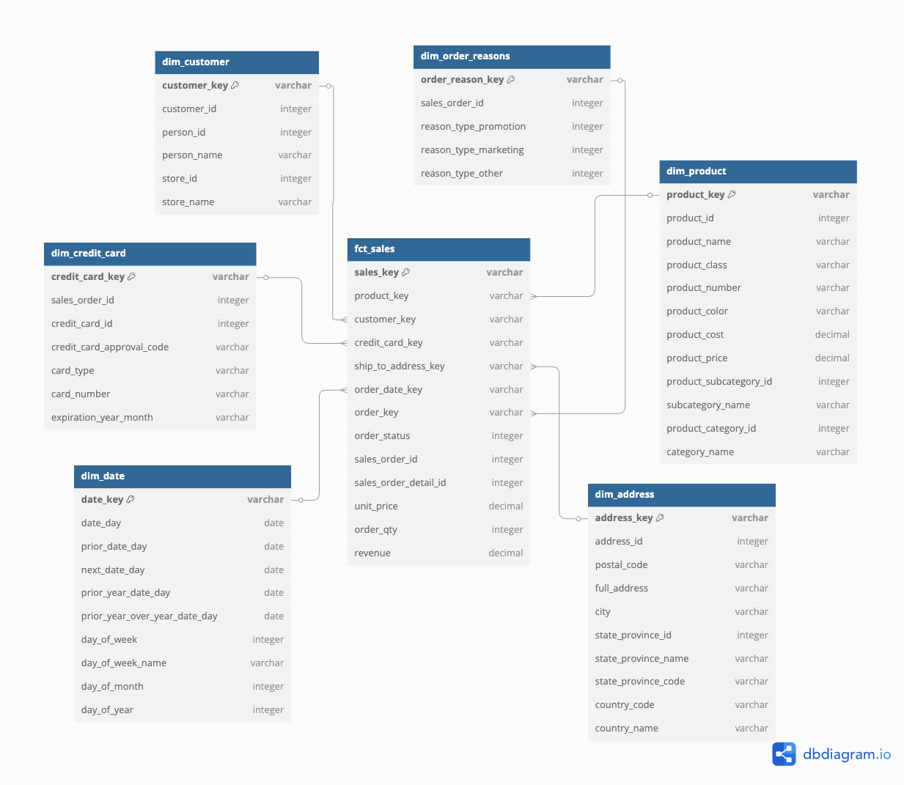
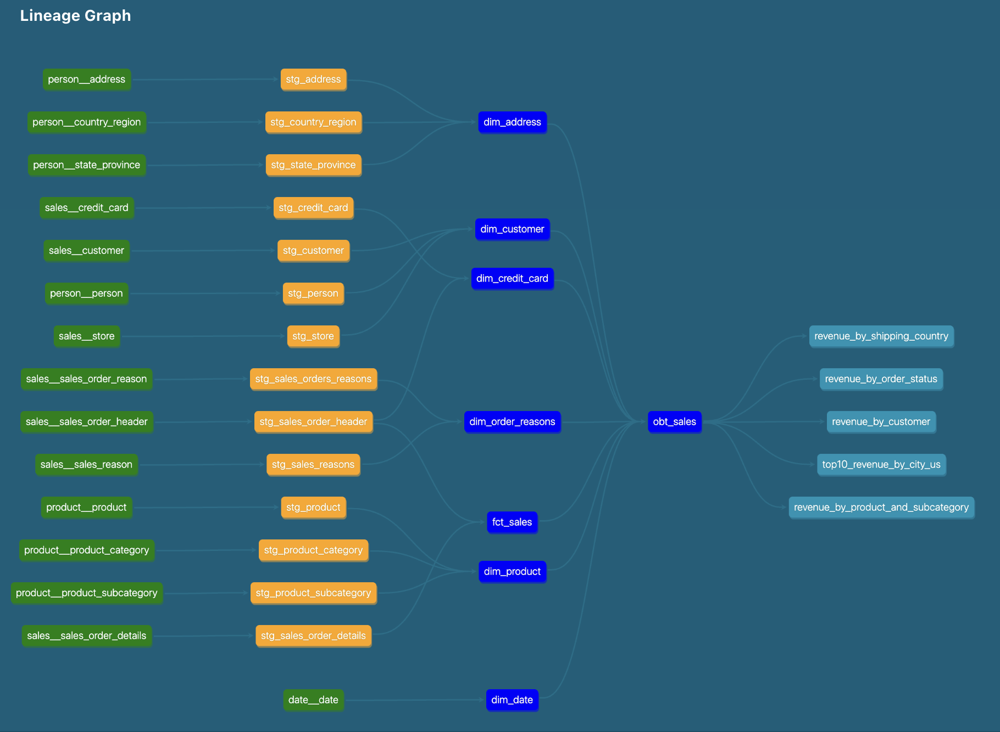

# Dimensional Data Modeling with dbt

## About
This project is a hands-on implementation of dimensional data modeling using dbt.

It is based on the tutorial ["Building a Kimball Dimensional Model with dbt"](https://github.com/Data-Engineer-Camp/dbt-dimensional-modelling), applying the Kimball methodology to build a Star Schema model and, later on, a OBT (One-Big-Table) using the AdventureWorks dataset to answer proposed business questions.

The goal is to showcase how to structure a modern analytics pipeline using dbt — focusing on clean data modeling, transformation best practices, and documentation — while simulating a Data Warehouse using a PostgreSQL container running within Docker.

<project_architecture_digram>


## Objectives
 - Set up the project environment, including the database and dbt project structure.
 - Analyze business requirements to inform the design of the dimensional model.
 - Ingest raw data into the warehouse using dbt seed functionality.
 - Design and implement dimension tables following best practices in dimensional modeling.
 - Design and implement the central fact table to capture key business processes.
 - Document the data models using dbt docs and visualize relationships with an ER diagram.
 - Develop SQL views and queries to support business end-user analysis.

## Table of Contents
- [About](#about)
- [Objectives](#objectives)
- [Project Structure](#project-structure)
- [Dimensional Model Overview](#dimensional-model-overview)
- [Data Model Diagram / ER Diagram](#data-model-diagram--er-diagram)
- [Data Model Lineage](#data-model-lineage)
- [Business Insights & SQL Analysis](#business-insights--sql-analysis)
  - [Dataset Overview](#dataset-overview)
  - [Analytical Queries](#analytical-queries-built-on-the-dimensional-model)
- [Requirements](#requirements)
- [Setup Instructions](#setup-instructions)
  - [1. Clone and Set Up the Project](#1-clone-and-set-up-the-project)
  - [2. Start the PostgreSQL Docker Container](#2-start-the-postgresql-docker-container)
  - [3. Initialize the dbt Project](#3-initialize-the-dbt-project)
  - [4. Run the dbt Pipeline](#4-run-the-dbt-pipeline)
  - [5. Generate and View dbt Documentation](#5-generate-and-view-dbt-documentation)
- [References & Credits](#references--credits)


## Project Structure
```bash
dbt-dimensional-modeling/
├── dbt_adworks/                 # Main dbt project directory
│   ├── analyses/                # SQL for business analyses not part of models
│   ├── macros/                  # Reusable SQL/Jinja functions
│   ├── models/                  # Core dbt models
│   │   ├── staging/             # Staging tables scripts based on the raw data
│   │   └── marts/               # Facts & dimensions tables for dimensional model
│   ├── seeds/                   
│   │   └── raw/                 # Raw data used to mimicking source systems
│   ├── snapshots/               
│   ├── tests/                   
│   ├── dbt_project.yml          # dbt project configuration
│   ├── packages.yml             # dbt package dependencies
│   └── profiles.yml             # dbt profile (usually located in ~/.dbt/)
├── docker/                      # Docker setup for Postgres container
├── assets/                      # Common commands and visual assets
├── requirements.txt             # Python requirements
└── README.md                    
```


## Dimensional Model Overview

- ***Dimensional modeling*** focuses on delivering data that is understandable to the business and optimized for fast analytical queries. It is commonly referred to as a star schema.

- ***Star schema*** is a way to structure a database where data is organized into fact tables and dimension tables. It gets its name because the layout resembles a star - with the fact table at the center and dimension tables branching out from it.

- ***Fact tables*** contain the measurable and transactional data such as sales, logs, or events. These tables hold the measures of the model and include their own primary key (PK) as well as foreign keys (FKs) linking to dimension tables.

- ***Dimension tables*** provide context to the facts—typically storing the descriptive categories used in analysis (e.g., customer, product, date). Their primary keys (PKs) are referenced by the fact table.

- ***One-big table (OBT)*** is a denormalized data model where all relevant facts and dimensions are combined into a single wide table. It simplifies data access making it easier to run ad hoc queries and generate dashboards. 


## Data Model Diagram / ER Diagram


- `fct_sales` - contains individual sales transactions. It stores key measures like revenue, quantity, and unit price.

- `dim_product` - contains detailed information about products, including product names, categories, pricing, etc.

- `dim_customer` - contains customer-related data enabling sales analysis from the perspective of individual customers or retail stores.

- `dim_credit_card` - stores credit card transaction details associated with sales orders.

- `dim_address` - provides geographic context by storing shipping addresses.

- `dim_date` - dimension table that enables time-based analysis.

- `dim_order_reasons` - contains reasons for orders such as promotions, marketing, or other drivers.


## Data Model Lineage



## Business Insights & SQL Analysis

### Dataset Overview
The dataset is based on AdventureWorks, a company that manufactures bicycles and sells them both to consumers (B2C) 
and businesses (B2B). Products are shipped globally to customers across various markets.

#### Analytical queries built on the Dimensional Model:
* [Total Revenue in 2011 by product category and subcategory](dbt_adworks/analyses/revenue_by_product_and_subcategory.sql)
* [Total Revenue in 2011 by customer](dbt_adworks/analyses/revenue_by_customer.sql)
* [Total Revenue in 2011 by order status](dbt_adworks/analyses/revenue_by_order_status.sql)
* [Total Revenue in 2011 by Shipping Country](dbt_adworks/analyses/revenue_by_shipping_country.sql)
* [Top 10 cities in the United States by total revenue (the company’s largest market)](dbt_adworks/analyses/top10_revenue_by_city_us.sql)


## Requirements
- **Python 3.8+** – Required to run dbt and manage the virtual environment  
- **Docker & Docker Compose** – Used to run PostgreSQL as the local data warehouse  


## Setup Instructions
### 1. Clone and Set Up the Project
- Clone this repository:
    ```bash
    git clone https://github.com/lamorasjr/dbt-dimensional-modeling.git
    ```

- Change to the repo directory:
    ```bash
    cd dbt-dimensional-modeling
    ```

- Create and activate a Python virtual environment (Note: Activation command may vary on Windows):
    ```bash
    python -m venv .venv

    source .venv/bin/activate  # On Windows, use: .venv\Scripts\activate
    ```
    
- Install the project dependencies:
    ```bash
    pip install -r requirements.txt
    ```

- Update `profiles.yml` — (Only necessary if you're using a different database as your data warehouse)

### 2. Start the PostgreSQL Docker Container
- Navigate to the `docker/` directory:
    ```bash
    cd docker/
    ```

- Start the PostgreSQL container:
    ```bash
    docker-compose up -d
    ```

### 3. Initialize the dbt Project
- Navigate to the dbt project folder:
    ```bash
    cd dbt_adworks/
    ```
    
- Install dbt package dependencies:
    ```bash
    dbt deps
    ```

- Validate your dbt setup:
    ```bash
    dbt debug
    ``` 

### 4. Run the dbt Pipeline
- Build the entire dbt project (models + tests):
    ```bash
    dbt build
    ```

### 5. Generate and View dbt Documentation
- Generate documentation:
    ```bash
    dbt docs generate
    ```

- Serve the documentation locally:
    ```bash
    dbt docs serve
    ```


## References & Credits

The content of this project is my approach for the tutorial presented in the bellow project and article:

- Article: [Building a Kimball dimensional model with dbt](https://docs.getdbt.com/blog/kimball-dimensional-model)
- Github Repo: [Data-Engineer-Camp/dbt-dimensional-modelling](https://github.com/Data-Engineer-Camp/dbt-dimensional-modelling/tree/main)


### Additional resources:
- More about dbt: [dbt Docs](https://docs.getdbt.com/docs/introduction)
- Project dataset: [AdventureWorks](https://learn.microsoft.com/en-us/sql/samples/adventureworks-install-configure?view=sql-server-ver17&tabs=ssms)
- ER Diagram graph: [Diagram.io](https://dbdiagram.io/d)
